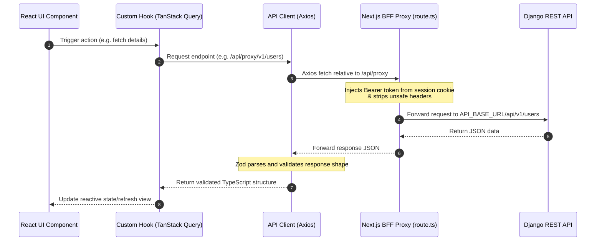

# PSR Frontend Implementation & Architecture Guide

Welcome to the **Policy and Scientific Research (PSR) Frontend Application**. This repository is built on a modern **Next.js 16 (React 19)** stack and implements a secure Backend-For-Frontend (BFF) proxy architecture to interact with the Django REST backend.

This document serves as the canonical source for the project structure, local development environment setup, architectural patterns, and formatting guidelines.

---

## 1. Directory Structure

The frontend application follows a strict modular design layout designed for scalability, strong separation of concerns, and type safety.

```text
frontend/
├── api/                        # Canonical HTTP Client & API Registry
│   ├── client.ts               # BFF-pointing Axios client with refresh logic
│   ├── endpoints.ts            # Centralized API endpoint routes registry
│   └── index.ts                # Main export entrypoint
├── app/                        # Next.js App Router Directory
│   ├── api/                    # Server-side Next.js route handlers
│   │   ├── auth/               # NextAuth v5 endpoint routes
│   │   └── proxy/              # BFF security & SSRF-safe forwarding layer
│   │       └── [...path]/      
│   │           └── route.ts    # Catch-all API proxy controller
│   ├── (public)/               # Public routing group (landing, about)
│   ├── (auth)/                 # Authentication routes (login, register)
│   ├── (dashboard)/            # Authenticated admin & operator dashboard
│   ├── globals.css             # Main stylesheet imports
│   ├── layout.tsx              # Root HTML wrapper and fonts
│   ├── page.tsx                # Homepage routing dispatcher
│   └── providers.tsx           # Global React providers wrapper
├── components/                 # Visual User Interface Components
│   ├── layout/                 # Sidebar navigation, top header, footer
│   ├── shared/                 # Reusable tables, filters, custom controls
│   ├── ui/                     # Radix UI design system primitives (Shadcn)
│   ├── policies/               # Policy drafting and repository visual modules
│   ├── research/               # Research proposal and evaluation views
│   ├── settings/               # Profile, password, IP whitelist settings
│   ├── RichTextEditor.tsx      # Tiptap-powered rich text input field
│   └── signature-pad.tsx       # Signature capturing component
├── hooks/                      # Custom React Hooks (TanStack Query hooks)
│   ├── useAuth.ts              # Session management and permission guards
│   ├── useUsers.ts             # User directory management queries/mutations
│   └── index.ts                
├── lib/                        # Infrastructure and utility libraries
│   ├── api/                    # Lower-level client adapters
│   ├── validators/             # Zod data schemas
│   ├── rbac.ts                 # Role-Based Access Control logic
│   ├── query-client.ts         # Query client config for TanStack Query
│   ├── safe-parse.ts           # Defensively parsing server payloads
│   └── utils.ts                # String, color, and CSS helpers
├── public/                     # Static media, icons, and logo assets
├── stores/                     # Client-side state containers (Zustand)
│   └── auth-store.ts           # Authentication and roles client-store
├── styles/                     # Tailwind custom styling & overlays
│   └── date-picker.css         
├── types/                      # Explicit TypeScript declarations
│   └── grant-call.ts           
├── tsconfig.json               # TypeScript configuration parameters
└── package.json                # Project dependencies and script declarations
```

### Core Directory Details
- **`api/`**: The frontend must not reference raw backend endpoints anywhere else. The endpoint paths are registered in `endpoints.ts` and requests are executed using the `apiClient` defined in `client.ts`.
- **`app/api/proxy/[...path]/route.ts`**: The BFF Proxy. Any browser requests sent to `/api/proxy/*` are securely processed on the Next.js server, injected with server-side credentials, and forwarded to the backend.
- **`components/ui/`**: Houses reusable custom primitives built on Radix UI and Tailwind CSS (such as Buttons, Dialogs, Selects, and Modals).
- **`stores/`**: Houses Zustand client-only states. Session state or backend queries must instead utilize the cache system of TanStack Query hooks.

---

## 2. Setting Up & Installation

Follow these steps to run the frontend application locally on your computer.

### 2.1 Prerequisites
Ensure you have the following installed on your machine:
*   **Node.js**: `v18.0.0` or higher (LTS recommended)
*   **npm**: `v9.0.0` or higher (packaged with Node)

### 2.2 Local Environment Settings
Create an environment file named `.env.local` inside the `frontend/` folder:

```ini
# Real backend base URL (Server-side execution only. DO NOT prefix with NEXT_PUBLIC_)
API_BASE_URL=http://localhost:8000

# NextAuth configuration
NEXTAUTH_URL=http://localhost:3000
AUTH_SECRET=a_very_long_cryptographically_secure_random_string_here
```

> [!WARNING]
> Do **never** use the prefix `NEXT_PUBLIC_` for your backend URL (e.g. `NEXT_PUBLIC_API_URL`). Doing so forces Webpack to bundle the backend URL string directly into client-side JS bundles, exposing your actual backend infrastructure to the browser.

### 2.3 Installation Steps
1. Navigate to the frontend directory:
   ```bash
   cd frontend
   ```
2. Install the project dependencies:
   ```bash
   npm install
   ```
3. Start the local development server:
   ```bash
   npm run dev
   ```
4. Open your browser and navigate to `http://localhost:3000`.

### 2.4 Production Builds
To test the production build locally and ensure there are no compilation or type-safety bottlenecks:
```bash
# Compile TypeScript and bundle NextJS project
npm run build

# Start the built production server locally
npm run start
```

---

## 3. Architecture & Data Flow

This application is built around the **BFF (Backend-for-Frontend) Proxy Pattern**. Client-side components make requests to Next.js routes, which securely proxy requests to the Django REST server.

### 3.1 Data Flow Sequence



### 3.2 Security & Proxy Mechanism
The Next.js route handler at `/app/api/proxy/[...path]/route.ts`:
1.  Intercepts any request directed to `/api/proxy/*`.
2.  Resolves target paths to `API_BASE_URL` securely.
3.  Injects the active authentication token (either from the client `Authorization` header or NextAuth session cookie).
4.  Strips hop-by-hop headers (`host`, `connection`, `content-length`, etc.) and sends the request upstream using a server-side `fetch`.
5.  Returns the normalized response back to the client.

---

## 4. Code Formatting & Styling Guidelines

To maintain project consistency, readability, and compatibility across modules, all developers must adhere to these guidelines.

### 4.1 Strict Type Safety
*   **No Implicit Any**: Keep `"strict": true` active in `tsconfig.json`. Explicit type definitions must be provided for all inputs, outputs, and helpers.
*   **Inferring Types from Zod**: Define database or API payload schemas using **Zod** first, and derive TS interfaces directly from them.

```typescript
import { z } from "zod";

export const UserProfileSchema = z.object({
  id: z.string().uuid(),
  username: z.string().min(3),
  phone: z.string(),
  email: z.string().email(),
  enabled: z.boolean(),
});

export type UserProfile = z.infer<typeof UserProfileSchema>;
```

### 4.2 Naming Conventions

| Item | Case Style | Example |
| :--- | :--- | :--- |
| **Components** | PascalCase | `AppSidebar.tsx`, `RichTextEditor.tsx` |
| **Hooks** | camelCase (prefixed with `use`) | `useAuth.ts`, `useUsers.ts` |
| **Services / Helpers** | camelCase | `rbac.ts`, `safe-parse.ts` |
| **Constants & Endpoints** | UPPER_SNAKE_CASE | `API_ENDPOINTS`, `BLOCKED_REQUEST_HEADERS` |
| **TypeScript Types** | PascalCase | `UserProfile`, `ApiError` |
| **Folders** | kebab-case | `components/layout/`, `app/(dashboard)/` |

### 4.3 Styling System (Tailwind CSS v4)
The project utilizes **Tailwind CSS v4** in `globals.css` with a CSS-variable configuration theme instead of standard config files.
*   Use Tailwind utility classes directly in TSX.
*   Manage theme tokens (background, primary, border) dynamically using variables.
*   Path mapping: `@/*` resolves to the project root directory. Always use `@/components/...` instead of `../../components/...`.

Example of theme-compliant component layout styling:
```tsx
export function CardComponent({ children }: { children: React.ReactNode }) {
  return (
    <div className="bg-card text-card-foreground border-border rounded-lg border p-6 shadow-sm">
      {children}
    </div>
  );
}
```

### 4.4 Form Control & Validation
*   Forms must be controlled using `react-hook-form` and validated using `zod` schemas.
*   Error messages must be displayed under inputs in a red theme (`text-destructive`).

---

## 5. API Response & Error Handling

All requests via `apiClient` return standard promises. In the event of failure, the Axios response interceptor normalizes error envelopes into a typed `ApiError` structure:

```typescript
export interface ApiError {
  message: string;             // User-facing localized error string
  status: number;              // HTTP Status code (e.g. 401, 403, 502)
  code?: string;               // Optional backend code string
  errors?: Record<string, string[]>; // Field-specific validation errors map
}
```

### 5.1 Handling API Requests in UI

```typescript
import { useMutation, useQueryClient } from "@tanstack/react-query";
import apiClient from "@/api/client";
import { API_ENDPOINTS } from "@/api/endpoints";
import { toast } from "sonner";
import { ApiError } from "@/api/client";

export function useUpdateUser() {
  const queryClient = useQueryClient();

  return useMutation({
    mutationFn: async ({ id, data }: { id: string; data: Partial<UserProfile> }) => {
      const response = await apiClient.put(API_ENDPOINTS.USERS.UPDATE(id), data);
      return response.data;
    },
    onSuccess: () => {
      queryClient.invalidateQueries({ queryKey: ["users"] });
      toast.success("User updated successfully");
    },
    onError: (error: ApiError) => {
      toast.error(`Update failed: ${error.message}`);
    },
  });
}
```
